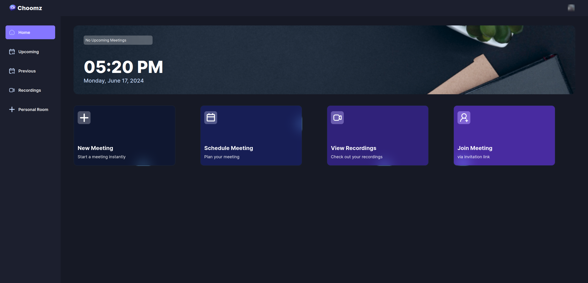

# 
### Video Conferencing App

 

## Table of contents
- [General Info](#general-info)
- [Getting Started](#getting-started)
- [Usage](#usage)
- [Technologies](#technologies)

## General Info
This project is a video conferencing app that replicates software like Zoom. It allows users to securely log in, create calls, interact with live chat during calls, and use various call tools such as settings, recording, and filters.

## Getting Started
- [Live App](https://video-conference-clone.vercel.app/) &nbsp; ↗️

## Usage
* **Authentication:** With Clerk's API, users can securely log in using social accounts or a conventional email and password method. Authorized access and permissions are implemented across the app. 🔒

* **Host or join meetings:** Start a new meeting or invite others. Before joining the call, users can configure microphone and camera settings. 🗣️

* **Schedule meetings:** Hosts can schedule upcoming meetings and set the details, including title, date, and time. 📅

* **Previous meetings:** Users can view past meetings that they either hosted or were a member of. Chat logs of the ended meetings are available as well. 🗨️ 

* **View recorded meetings:** Access your recordings of past meetings. 🔴

* **Host a personal room:** Each user has a personal room with a unique link. Great for quick meetings. 🔄

* **Join meetings:** Join meetings created by others by entering the link. 🤝

* **Meeting Controls / Customization:** Call participants can control many aspects of their meeting room. This includes speaker/members layout, microphone and camera inputs, live chat functionality, reactions, screen-sharing, camera background or blur customization, managing individual member states, and more. ⚙️

* **Responsive design:** Easily access the app across many devices. The app follows responsive design principles to fit different screen sizes and resolutions. 📱

## Technologies

  
  
  
  

  
  
  
  *Stream*

  

  *Clerk*

 

[Back to top](#video-conferencing-app)